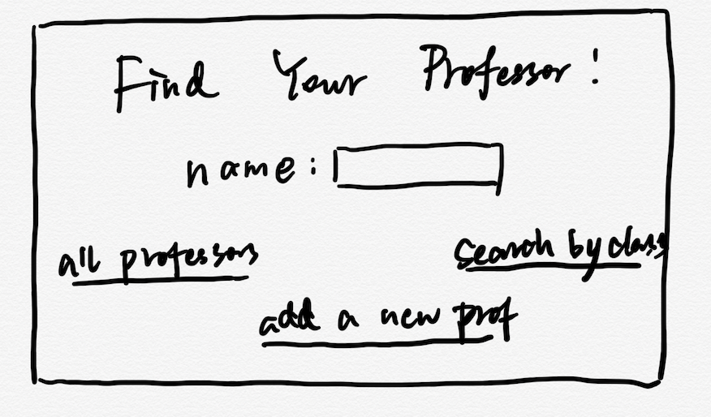

# Rate My Professor

## Overview

Rate My Professor is a web that provides students information of their professors and classes. All the students who have a registered account can have access to the platform and comment the professors/classes freely. : ) Also, some functionalities like document sharing(syllabus) may be enabled for class search option. 


## Data Model

The application will store Users and the state of each Game, using two schemas in total

* professors can have a name, comment, the list of classes he/she has taught, and rate
* each class can have a name, comment, the professors who have taught this class and their corresponding ratingss

An Example Professor:

```javascript
const ProfessorSchema = new mongoose.Schema({
  name: {type : String, required: true}, 
  email: {type: String},
  rate: {type : Array, default : []}, 
  class: {type : Array, default : []},
  comment: {type : Array, default : []},  
});
```

An Example Class with Embedded Items:

```javascript
const ClassSchema = new mongoose.Schema({
  name: String, 
  code: {type : Number, required: true}, 
  professors: {type : Array, default : []},  
});
```


## [Link to Commented First Draft Schema](src/db.js) 


## Wireframes

/login - page for loging in or create a new account


/homepage - the main interface page the user will see after loging in
            and the user can search for the professor by name



/allProfessors - page for showing all the professors on file


/newProfessor - page for adding a new professor/a professor who is not on file


/searchClass - page for searching for a certain class


## Site map
the site map


## User Stories

1. as non-registered user, I can register a new account with the website
2. if I am a registered user, I can use my username and password to log in
3. as a registered user, I can check any professor and class I want to look for
   for the class search, all the professors who have taught this course will be provided for comparison
4. as a registered user, I can comment on a existing professor
5. as a registered user, I can create a new professor if that professor does not exist yet

## Research Topics

* (6 points) Integrate user authentication
    * use passport for user authentication
    * see login page at: will be inserted later 
    * see register page at: will be inserted later
* (2 points) CSS framework/Bootstrap
    * Use a CSS framework throughout the site
    * will also add some animations to make the website look better
* (2 points) Perform client side form validation using JavaScript API
    * basically the task is to autimate the form input of the application 
    
10 points total out of 8 required points

## [Link to Initial Main Project File](src/app.js) 

## Annotations / References Used

1. [tutorial on Passport](https://medium.freecodecamp.org/learn-how-to-handle-authentication-with-node-using-passport-js-4a56ed18e81e)
2. [tutorial on Bootstrap](https://getbootstrap.com)
